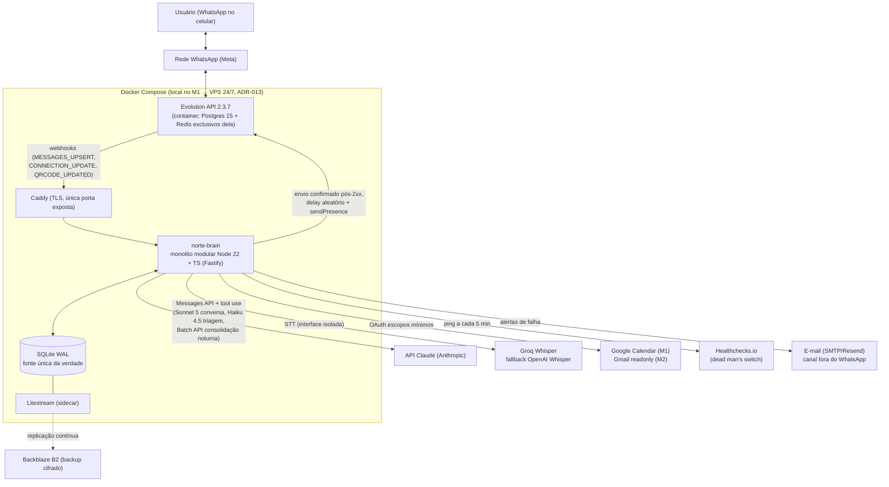
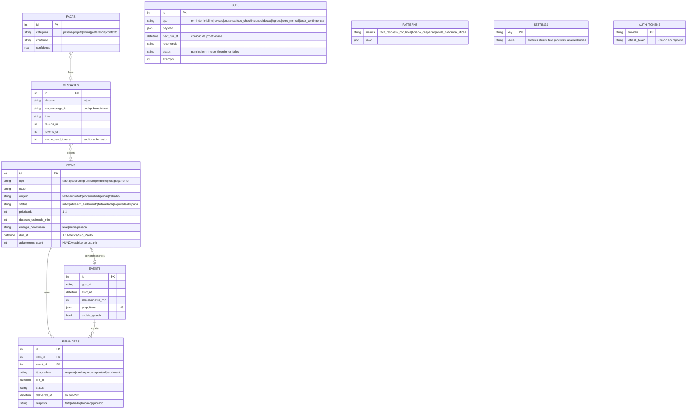
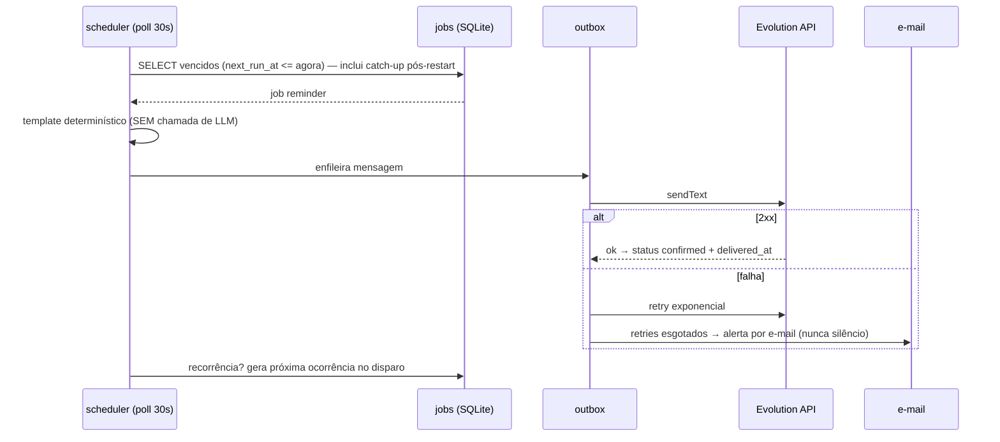

# Arquitetura — Norte

**Versão:** 0.1 · **Data:** 2026-08-25 · Referências: [PRD.md](PRD.md) · [SECURITY.md](SECURITY.md) · [TESTING.md](TESTING.md)

Stack: **sem frontend na v1 — UI 100% conversacional no WhatsApp (UIs futuras: Next.js + Tailwind v4 com o design system do MedClinic, ver ADR-012) · Node.js 22 + TypeScript strict com Fastify (backend) · SQLite WAL via better-sqlite3 · Docker Compose — local durante a construção do M1, VPS 24/7 a partir do hardening (ADR-013) — com Caddy TLS, Evolution API 2.3.7, Litestream → Backblaze B2 e Healthchecks.io no perfil de produção**.

Toda escolha técnica com impacto duradouro tem ADR em [docs/adr/](adr/) (ver §7).

---

## 1. Visão de Contêineres (C4 — nível 2)



Decisões-chave:

- **O LLM nunca é o registro.** O task-store em SQLite é a única fonte da verdade; toda escrita passa por tools strict validadas no backend. O modelo interpreta e conversa — se a API do Claude cair, só a conversa livre degrada; lembretes, briefing e revisão continuam (templates determinísticos).
- **Caminho crítico sem partes móveis frágeis:** jobs duráveis no SQLite com catch-up no boot, entrega confirmada só pós-2xx, retry exponencial, e nenhuma falha silenciosa (watchdog interno + dead man's switch externo + e-mail).
- **Monolito modular, não microserviços:** um processo Node, mas internamente organizado em módulos plugáveis com fronteiras impostas por lint (§2) — é o que permite crescer para MUITAS funcionalidades sem virar uma bola de lama.
- **Adapter em toda borda externa:** WhatsApp (Evolution → WAHA/Telegram em dias), STT (Groq → OpenAI), LLM (cliente único com estratégia de modelos). Nenhum fornecedor é ponto de acoplamento estrutural.
- **Tools declaradas uma vez, servidas em dois transportes:** o registry de tools do kernel é transport-agnostic — alimenta o tool use do brain e o servidor MCP para agentes externos (Claude Code, Codex — ADR-014); na direção inversa, o Norte dispara os CLIs desses agentes por subprocesso headless com login delegado a eles (ADR-015).

---

## 2. Estrutura do Repositório e Módulos (arquitetura modular)

**Princípio de projeto (exigência do dono):** o assistente vai acumular muitas funcionalidades ao longo dos anos. Cada capacidade é um **módulo plugável** que se registra no kernel por um **manifesto**; adicionar uma funcionalidade nova = criar uma pasta em `src/modules/` — sem tocar no core nem nos outros módulos.

```
.
├── docs/                       PRD, arquitetura, segurança, testes, ADRs, specs de feature
├── infra/
│   ├── docker-compose.yml      perfis local/producao (ADR-013): evolution (pinada 2.3.7), postgres+redis dela, brain; producao soma caddy e litestream
│   ├── Caddyfile               TLS; única superfície exposta (/webhook, /health)
│   └── litestream.yml          replicação SQLite → Backblaze B2
├── src/
│   ├── core/                   NÚCLEO ESTÁVEL — não conhece nenhum módulo
│   │   ├── kernel/             registro de módulos: carrega manifestos, compõe tools/jobs/comandos/prompt
│   │   ├── bus/                event bus interno tipado (pub/sub síncrono + outbox para efeitos)
│   │   ├── db/                 conexão SQLite (WAL), runner de migrações (inclusive as dos módulos)
│   │   ├── scheduler/          jobs duráveis: poll 30s, catch-up no boot, recorrência, retries
│   │   ├── outbox/             envio de mensagens: fila, confirmação pós-2xx, delay aleatório, sendPresence, teto diário de proativas
│   │   ├── llm/                provedores plugáveis (ADR-017): anthropic-api-key (padrão e único do caminho crítico), claude-account e openai-account (OAuth, M3); triagem (Haiku), brain (Sonnet), Batch API; prompt caching byte-estável; monitor de custo
│   │   ├── channel/            interface Channel + registry: whatsapp-evolution (ativo), api-compat OpenAI/Anthropic (M2, ADR-016), telegram (dormente, M3)
│   │   ├── mcp/                servidor MCP sobre o registry de tools do kernel — Claude Code/Codex operam o Norte (M2, ADR-014)
│   │   ├── stt/                interface de transcrição: groq (ativo), openai-whisper (fallback)
│   │   └── settings/           chaves tipadas com defaults declarados pelos módulos
│   ├── modules/                CAPACIDADES PLUGÁVEIS — uma pasta = uma funcionalidade
│   │   ├── tasks/              task-store: entidades items/reminders/events, estados, deleção lógica (único módulo "de dados" que os outros referenciam — via tools/serviços, nunca via SQL direto)
│   │   ├── capture/            triagem de mensagens recebidas → classificação → gravação → confirmação 1 linha (RF-01, RF-02)
│   │   ├── chains/             expansão determinística de compromissos em cadeias de lembrete (RF-04) e boletos (RF-25, M3)
│   │   ├── rituals/            briefing matinal, revisão noturna, retrospectiva mensal — com fallback template (RF-05, RF-06, RF-27)
│   │   ├── nudges/             fechamento de loop: cobranças 1/2/3, reagendamento inteligente, teto anti-spam (RF-08)
│   │   ├── next-action/        "qual a próxima?" (RF-09)
│   │   ├── return-mode/        supressor de proatividade + resumo de reentrada (RF-10)
│   │   ├── hygiene/            higiene automática da lista (RF-11)
│   │   ├── focus/              sessões de foco / body doubling por mensagem (RF-20, M2)
│   │   ├── breakdown/          micropassos, "só 5 minutos", if-then (RF-17, RF-18, M2)
│   │   ├── memory/             facts com confidence + consolidação noturna (RF-19, M2); patterns (RF-24, M3)
│   │   ├── vision/             foto/print → evento/tarefa/boleto (RF-16, M2)
│   │   └── integrations/
│   │       ├── google-calendar/  (RF-12, M1)
│   │       ├── gmail/            (RF-22, M2)
│   │       ├── work/             conector plugável Jira/Trello/Linear (RF-26, M3)
│   │       └── code-agents/      dispara Claude Code/Codex CLI headless com guardrails (RF-31, M3, ADR-015)
│   ├── admin/                  UI local de administração (M3, ADR-017): login OAuth de contas, status de provedores/integrações — servida pelo brain, design system MedClinic (ADR-012)
│   ├── infra-ops/              watchdog CONNECTION_UPDATE, ping Healthchecks, alertas por e-mail, métricas de entrega
│   └── app.ts                  composição: lista explícita de módulos ativos por fase (M1 liga 10, M2/M3 acrescentam)
└── tests/                      unit (domínio puro), integração (webhook→resposta), cenários (tom, falha injetada)
```

**O manifesto de módulo** (contrato único de extensão):

```ts
interface ModuleManifest {
  name: string;                          // identificador estável (prefixa migrações e settings)
  migrations?: Migration[];              // tabelas/colunas próprias do módulo
  tools?: ToolDefinition[];              // tools expostas ao brain (strict, validadas com zod no backend)
  commands?: CommandMatcher[];           // padrões do executor determinístico ("feito", "1", "adia...")
  jobs?: Record<string, JobHandler>;     // handlers dos tipos de job que o módulo agenda
  events?: Partial<EventHandlers>;       // assinaturas no bus (item.created, message.received, user.silent48h...)
  settingsDefaults?: SettingsMap;        // chaves de configuração com defaults
  promptFragment?: () => string;         // contribuição ao system prompt (determinística — cache byte-estável)
}
```

Regras de dependência (impostas por `eslint-plugin-boundaries`, não por disciplina):

- `core/` **nunca** importa de `modules/` — o kernel só conhece a interface `ModuleManifest`.
- Módulo importa **apenas** `core/` (interfaces) e o **contrato público** de `tasks/` (serviço/tools) — nunca internos de outro módulo, nunca SQL de tabela alheia.
- Módulo conversa com módulo por **eventos no bus** (ex.: `capture` emite `item.created`; `chains` reage criando reminders) — desligar um módulo não pode quebrar outro (exceção única: `tasks`, que é fundação).
- Fragmentos de prompt são concatenados em ordem determinística (por nome de módulo) — modularidade não pode invalidar o prompt caching.
- Lógica de domínio pura (expansão de cadeias, recorrência, seleção de prioridade, checagem de capacidade) vive em funções sem I/O dentro do módulo — 100% testáveis.

---

## 3. Modelo de Dados (ER)



Pontos de atenção (decisões que alguém vai querer "simplificar" no futuro — não simplifique):

- **Deleção sempre lógica** em todas as entidades (`dropada`/`arquivada`): sustenta o "dropar sem culpa" reversível e a auditoria. Nunca `DELETE`.
- **`adiamentos_count` existe para a higiene automática, não para o usuário.** Exibi-lo é bug de produto (RSD), coberto por teste de regressão de tom.
- **`jobs` é o coração da proatividade.** Nenhum comportamento proativo pode nascer fora dela (cron em memória é proibido — ADR-004); o catch-up no boot é testado.
- **`wa_message_id` deduplica webhooks** (a Evolution reentrega); o processamento de mensagem recebida é idempotente.
- **Timezone America/Sao_Paulo explícito** em todo armazenamento e cálculo de recorrência; testes cruzam meia-noite e virada de mês.
- Migrações pertencem aos módulos (prefixadas pelo nome do módulo) e rodam pelo runner do core em ordem estável.

### 3.1 Isolamento de dados

Sistema single-user (uma persona, um número autorizado): não há multi-tenancy. O isolamento relevante é de **borda**: o webhook só aceita eventos da instância Evolution autenticada, e mensagens de qualquer JID diferente do número do dono são ignoradas e logadas (ver [SECURITY.md](SECURITY.md)).

---

## 4. Núcleo de Domínio (pacotes puros)

Lógica crítica como funções puras, sem I/O, testáveis isoladamente:

- **`chains/domain`** — expansão de compromisso em cadeia (véspera/manhã/preparo com deslocamento) e de pagamento em cadeia de vencimento. Entrada: evento + settings; saída: lista de reminders. Nunca LLM.
- **`scheduler/domain`** — cálculo de próxima ocorrência de recorrência (TZ-aware), elegibilidade de catch-up no boot.
- **`next-action/domain`** — seleção da UMA próxima ação (prazo, prioridade, hora do dia, energia em M2).
- **`rituals/domain`** — montagem dos dados do briefing/revisão (agenda + 3 prioridades + micropasso) e templates de fallback; capacidade real vs. horas livres (M2).
- **`nudges/domain`** — elegibilidade de cobrança (vencidos, teto diário, supressor do modo retorno) e proposta de reagendamento a partir de patterns.

Regra de extensão: caso novo do domínio = novo módulo (ou nova implementação da interface no módulo), sem modificar o existente. O servidor sempre recalcula estado a partir do task-store — nunca confia em texto do modelo como fato.

### 4.1 Sequência — fluxo crítico de escrita (captura por áudio)

```mermaid
sequenceDiagram
    participant WA as Evolution API
    participant B as brain (Fastify)
    participant T as triagem (Haiku)
    participant TS as task-store (SQLite)
    participant O as outbox

    WA->>B: POST /webhook (MESSAGES_UPSERT, audio)
    B->>B: valida payload (zod) + dedup wa_message_id + JID = dono?
    B->>WA: getBase64FromMediaMessage (busca ativa, nunca o base64 do webhook)
    B->>B: STT (Groq; fallback OpenAI; falha total → pede texto)
    B->>T: transcrição → N ações (output estruturado)
    T-->>B: [{tipo, titulo, due_at?}, ...]
    B->>TS: tools strict validadas no backend (create_task/create_event)
    TS-->>B: itens gravados (fonte da verdade)
    B--)B: bus: item.created → chains agenda reminders na tabela jobs
    B->>O: confirmação em 1 linha (sem NENHUMA pergunta)
    O->>WA: sendText (delay aleatório + sendPresence)
    WA-->>O: 2xx → delivered_at gravado
```

### 4.2 Sequência — disparo de lembrete (caminho 100% determinístico)



O briefing (RF-05) segue o mesmo esqueleto com um desvio: os dados são coletados por código, o Sonnet só **redige**; timeout/erro do LLM cai no template de fallback com os mesmos dados.

---

## 5. API — princípios

Não há API pública na v1. A superfície HTTP inteira é interna ao Compose, atrás do Caddy:

- **`POST /webhook/evolution`** — única entrada de eventos. Validação de contrato com zod em 100% dos payloads; autenticação por segredo de webhook + filtro de instância; dedup por `wa_message_id` (idempotência); resposta rápida (processamento assíncrono via bus/jobs).
- **`GET /health`** — estado dos subsistemas (sessão WhatsApp, scheduler, DB, última entrega) para o watchdog e o ping do Healthchecks.
- **Tools do LLM são a "API" do domínio:** JSON Schema strict (`additionalProperties: false`), validação zod no backend antes de qualquer escrita, e limites de negócio (teto de proativas, estados válidos) impostos no task-store — nunca no prompt.
- Formato de erro interno padronizado com correlation-id (id da mensagem/job) propagado em logs estruturados.
- Exceção a qualquer princípio acima pede ADR.

---

## 6. Error Reporting e Observabilidade

Erro que ninguém vê não existe até virar incidente — e aqui incidente significa lembrete perdido, o pecado capital do produto:

- **Logs estruturados** (pino) com correlation-id por mensagem/job; níveis: fluxo normal em `info`, degradação em `warn`, falha de entrega em `error`.
- **Watchdog interno:** `CONNECTION_UPDATE`/`QRCODE_UPDATED` monitorados; sessão caída → e-mail com instrução de re-scan em ≤ 5 min.
- **Dead man's switch externo:** ping ao Healthchecks.io a cada 5 min; ausência alerta por e-mail mesmo com o VPS inteiro morto.
- **Alertas por e-mail (canal fora do WhatsApp):** retries de entrega esgotados, refresh OAuth falho, disco > 85%, projeção de custo > US$25, `cache_read_input_tokens = 0` em chamadas repetidas.
- **Auditoria de entrega:** toda mensagem proativa tem trilha job → outbox → 2xx → `delivered_at`; a métrica de 99,5% do PRD é calculada daqui.
- **Monitor de custo:** usage por chamada na tabela `messages`; relatório mensal no log; alarme nos limiares.
- Deploy: `docker compose up -d` com healthcheck; restore do backup Litestream testado a cada milestone (gate no [TESTING.md](TESTING.md)).

---

## 7. ADRs resumidas

| # | Decisão | Motivo |
|---|---|---|
| [ADR-001](adr/ADR-001-claude-messages-api.md) | Claude Messages API direta (tool use manual), não Agent SDK | Daemon de webhooks com controle total de caching, custo e persistência; Agent SDK é para agentes de código |
| [ADR-002](adr/ADR-002-evolution-pin-e-licenca.md) | Evolution API pinada na última estável (2.3.7); 2.4.x só quando estável | Licença community da 2.4.0+ é gratuita, mas adiciona ativação obrigatória (servidor de licenças no boot) e telemetria; upgrade só após teste em paralelo |
| [ADR-003](adr/ADR-003-sqlite-unica-persistencia.md) | SQLite WAL como única persistência do brain | Single-user, zero operação, backup por Litestream; Postgres/Redis existem só como dependências internas da Evolution |
| [ADR-004](adr/ADR-004-scheduler-duravel.md) | Scheduler durável em tabela `jobs` (poll 30s, catch-up no boot) | Lembrete perdido em restart é falha inaceitável; cron em memória proibido |
| [ADR-005](adr/ADR-005-numero-secundario-antiban.md) | Número secundário dedicado + política anti-banimento | Banimento vira troca de chip em minutos; dados nunca vivem no WhatsApp |
| [ADR-006](adr/ADR-006-caminho-critico-sem-llm.md) | Caminho crítico determinístico, LLM opcional | Templates para lembretes e fallback para rituais; a API do Claude nunca é ponto único de falha do valor diário |
| [ADR-007](adr/ADR-007-estrategia-modelos-caching.md) | Haiku 4.5 triagem + Sonnet 5 conversa, prompt byte-estável, Batch API noturna | Teto de custo ≤ US$32/mês orçado no preço cheio; sem Opus |
| [ADR-008](adr/ADR-008-ux-menu-texto.md) | UX por menu de texto numerado; botões/listas/enquetes banidos | Instáveis no Baileys (issues #2390, #2404); decisão de design, não adiamento |
| [ADR-009](adr/ADR-009-delecao-logica.md) | Deleção sempre lógica em todas as entidades | Sustenta "dropar sem culpa" reversível e auditoria |
| [ADR-010](adr/ADR-010-oauth-google-producao.md) | OAuth Google como app External "In Production", escopos mínimos | Refresh token de modo Testing expira em 7 dias e quebra em silêncio |
| [ADR-011](adr/ADR-011-monolito-modular-manifesto.md) | Monolito modular: kernel + módulos com manifesto, fronteiras por lint | Exigência do dono: muitas funcionalidades futuras; adicionar capacidade = nova pasta em `modules/`, sem tocar no resto |
| [ADR-012](adr/ADR-012-design-system-medclinic.md) | Qualquer UI futura usa o design system do MedClinic | Consistência entre os produtos do dono: Tailwind v4, paleta zinc dark-first + emerald, componentes de `ui.tsx`, tema claro por remapeamento de variáveis |
| [ADR-013](adr/ADR-013-operacao-inicial-local.md) | Operação inicial local (Compose perfil `local`); VPS no hardening do M1 | Iteração rápida e sem custo na construção; catch-up no boot torna o gap tolerável; saída do M1 exige uma semana 100% no VPS |
| [ADR-014](adr/ADR-014-integracao-mcp.md) | Servidor MCP como segundo transporte do registry de tools | Claude Code/Codex operam o Norte com 1 servidor para N agentes; validação única no backend; registry transport-agnostic desde a FEAT-001 |
| [ADR-015](adr/ADR-015-orquestracao-cli-agentes.md) | Norte dispara Claude Code/Codex CLI headless; login delegado aos CLIs | Zero credencial de conta no Norte; guardrails bloqueantes (allowlist de diretórios, confirmação no chat, auditoria) |
| [ADR-016](adr/ADR-016-canal-api-nativo.md) | Canal API nativo compatível OpenAI/Anthropic (estilo 9router) | Qualquer ferramenta com base URL customizado conversa com o Norte sem plugin; segunda implementação da interface Channel, mesmo funil e validação |
| [ADR-017](adr/ADR-017-provedores-llm-login-contas.md) | Provedores de LLM plugáveis; login de contas Claude/OpenAI pela UI (estilo OmniRoute) | Assinaturas do dono viram capacidade do Norte; caminho crítico sempre em API key; risco de ToS isolado, com fallback automático |
| [ADR-018](adr/ADR-018-webhook-ack-processamento-assincrono.md) | Webhook: ACK imediato + processamento em background + varredura no boot | Triagem LLM não pode segurar a conexão da Evolution; ≤ 15s do RF-01 preservado; crash não perde captura |
